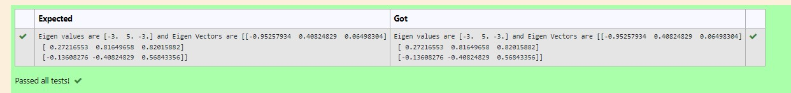

# EIGENVALUES-AND-EIGENVECTORS
## Aim:
To write a python program to find the Eigenvalues and Eigen Vectors
## Equipment’s required:
1. 	Hardware – PCs
2. 	Anaconda – Python 3.7 Installation / Moodle-Code Runner
## Algorithm:
### Step1 : 
### Step 2: 
### Step 3: Using the np.linalg.eig(),  we get two results (first is eigenvalue and second is eigenvector) of the given matrix.
### Step 4: 

## Program:
```
#Program to find the solution for the given linear equations.
#Developed by: M,vidya neela
#RegisterNumber:21500298
import numpy as np
A=np.array([[1,-3],[3,1]])
B=np.array([0,10])
value=np.linalg.solve(A,B)
print(value)
```

## Output:




## Result:
Thus the Eigenvalue and Eigenvector is successfully solved using python program
